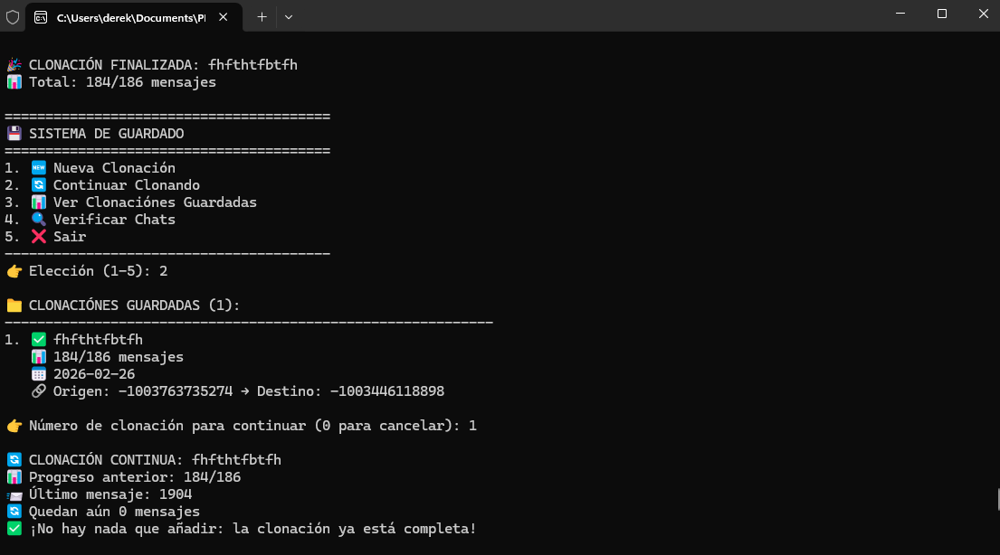

# 🚀 Cloner Albóndiga Telegram

  
 
 <b>🔥 Clona mensajes de Telegram de forma automática, rápida y eficiente 🔥</b> 
 
    

🎬 Demo

 <video src="2026-02-26_12-04-13.mp4" width="700" controls></video> 

🧠 Descripción

Cloner Albóndiga Telegram es una herramienta avanzada para clonar mensajes entre chats de Telegram.

💡 Pensado para usuarios que necesitan:

Migrar chats completos

Respaldar conversaciones

Automatizar procesos repetitivos

✨ Características

⚡ Clonación rápida de mensajes

💾 Sistema de guardado automático

🔄 Reanudación de procesos

📊 Seguimiento de progreso en tiempo real

🔍 Verificación de chats

⚙️ Requisitos
📱 Cuenta de Telegram

Necesitas una cuenta activa.

🤖 Cuenta de desarrollador (OBLIGATORIO)

Debes crear una aplicación en Telegram para obtener:

🔑 API ID

🔐 API HASH

👉 https://my.telegram.org

🛠️ Uso

Ejecuta el programa y utiliza el menú interactivo:

1. Nueva Clonación
2. Continuar Clonando
3. Ver Clonaciones Guardadas
4. Verificar Chats
5. Salir

📁 Estructura del proyecto
📦 Cloner-Albondiga
 ┣ 📂 assets
 ┃ ┗ icon.ico
 ┣ 📄 cloner.py
 ┣ 📄 README.md
 ┗ 📂 dist

⚠️ Importante

🔴 No uses cuentas principales (riesgo de limitaciones)

🔴 Respeta los límites de Telegram

🔴 Usa el programa bajo tu responsabilidad

⚖️ Licencia
🚫 Propiedad exclusiva

Este software está bajo jurisdicción directa del creador:

👤 @derekjunior

❗ Solo el creador puede vender el programa

❗ Prohibida su reventa

❗ No redistribuir sin autorización

💬 Contacto

Para soporte o dudas:

📩 Discord: @derekjunior & [SilentX](https://discord.gg/XkrGhEZHQ6)

⭐ Nota final

Si este proyecto te sirve…

---

## 💖 DONAR

Si te gusta el proyecto y quieres apoyarlo, puedes donar aquí:

> Tu apoyo permite mantener y mejorar **AutokeyclickerX V1**, agregando nuevas funciones y mejoras 🚀

👉 Dale estrella ⭐
👉 Compártelo
👉 Úsalo con cabeza 😎
