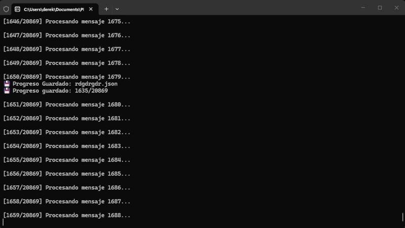

# 🚀 Cloner Albóndiga Telegram

  
  

 <b>🔥 Clona mensajes de Telegram de forma automática, rápida y eficiente 🔥</b> 
  

 
 
 
 
 

---

## 🎬 Demo

  

---

## 🧠 Descripción

**Cloner Albóndiga Telegram** es una herramienta avanzada diseñada para clonar mensajes entre chats de Telegram de forma automatizada.

💡 Pensado para usuarios que necesitan:

- Migrar chats completos  
- Respaldar conversaciones  
- Automatizar procesos repetitivos  
- Gestionar grandes volúmenes de mensajes  

---

## ✨ Características

- ⚡ Clonación rápida de mensajes  
- 💾 Sistema de guardado automático  
- 🔄 Reanudación de procesos interrumpidos  
- 📊 Seguimiento de progreso en tiempo real  
- 🔍 Verificación de chats  
- 🧠 Sistema optimizado para estabilidad  
- 🖥️ Compatible con Windows  

---

## ⚙️ Requisitos

### 📱 Cuenta de Telegram
Necesitas una cuenta activa.

### 🤖 Cuenta de desarrollador (OBLIGATORIO)

Debes crear una aplicación en Telegram para obtener:

- 🔑 API ID  
- 🔐 API HASH  

👉 https://my.telegram.org  

---

## 🛠️ Uso

Ejecuta el programa y utiliza el menú interactivo:

1. Nueva Clonación

2. Continuar Clonando

3. Ver Clonaciones Guardadas

4. Verificar Chats

5. Salir

---

## 📁 Estructura del proyecto

📦 Cloner-Telegram-Albondiga
┣ 📂 assets
┃ ┗ image.png
┣ 📄 cloner.py
┣ 📄 README.md
┗ 📂 dist

---

## ⚠️ Aviso Legal

El autor de este software no se hace responsable del uso indebido de la herramienta.

Este proyecto ha sido desarrollado con fines educativos y de automatización legítima. El usuario asume toda la responsabilidad derivada de su uso.

El uso indebido puede conllevar:

- Suspensión de cuentas  
- Bloqueos permanentes  
- Pérdida de acceso a servicios  

**Al utilizar este software, aceptas que el autor queda exento de cualquier responsabilidad por daños o consecuencias derivadas de su uso.**

---

## ⚖️ Licencia

Este proyecto está bajo la licencia **GNU General Public License v3.0 (GPL-3.0)**  

- ✔️ Uso libre  
- ✔️ Modificación permitida  
- ✔️ Redistribución permitida  
- ❗ Debe mantenerse la misma licencia  
- ❗ Debe darse crédito al autor  

---

## 👤 Créditos

Desarrollado por **[@derekjunior](https://github.com/derekjunior)**  

---

## 💖 DONAR

> Tu apoyo permite mantener y mejorar el proyecto 🚀
